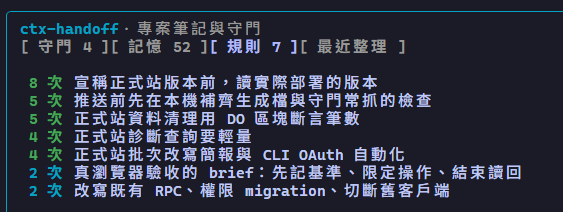

# ctx-handoff

[繁體中文](README.zh-TW.md)

[](https://github.com/cablate/ctx-handoff-mod/actions/workflows/check.yml) [](LICENSE)

**Keep long Claude Code conversations going on their own, and have Claude remember what you taught it.**

Long Claude Code sessions run into three chores:

- The conversation keeps growing until answers get slow, expensive and forgetful, so you write a summary, `/clear`, and paste the summary back.
- You step away for an hour, and your next message makes Claude reread the whole conversation, slowly and at full price.
- You explain the same thing in three conversations, and the next one has forgotten it again.

ctx-handoff handles these in the background. In normal use you type no commands.

| Situation | Before | With ctx-handoff |
|---|---|---|
| The conversation is nearly full | Summarize, clear and paste by hand | A handoff summary is written, the conversation is cleared, and the new one reports where things stand and waits for you |
| You step away | Everything is reread when you return | The conversation cache is kept warm while you're gone (up to about 4 hours); after that a handoff is saved and you choose whether to continue or start fresh |
| You repeat an instruction | A new conversation forgets it | It becomes a note for this project, loaded into your next conversation |


(The demo text is in Traditional Chinese.)

## Is it for you?

**A good fit** if you sign in with a Claude subscription, run long sessions (for example on a 1M-context model), and open Claude Code in your project folder.

**Less of a fit:**

- API-key, Bedrock or Vertex users: the conversation cache lasts only 5 minutes, so keeping it warm doesn't help and should be turned off (see [Limitations](#limitations)). Everything else works.
- Anyone who wants notes shared across projects: notes are kept per project folder.

**Status:** experimental. It uses Claude Code's mod feature, which is still in early access, so a Claude Code update may require changes. Messages are in English, or Traditional Chinese when your system language (or Claude Code's `language` setting) is Chinese. Project notes and handoff summaries are written in the language you use in the conversation; the notes file's section labels stay in Chinese.

## Quick start

Requires Claude Code 2.1.287 or later (mods are on by default from there). Tested up to 2.1.292.

```sh
claude plugin marketplace add cablate/ctx-handoff-mod
claude plugin install ctx-handoff@ctx-handoff-mod
```

Start a new session and type `/handoff`. A status like this means it's installed:

```
context 12034 / threshold 600000 (window 1000000)
Cache refresh on, refreshed 0/3 this idle period, timer not started
```

**Updates** aren't automatic. Run `claude plugin update ctx-handoff@ctx-handoff-mod`, or turn on auto-update under **Marketplaces** in `/plugin`.

**To work on the code,** load a clone instead; edits take effect when you save:

```sh
git clone https://github.com/cablate/ctx-handoff-mod ~/.claude/mods/ctx-handoff
claude --plugin-dir ~/.claude/mods/ctx-handoff
```

To load the clone in every session, add its absolute path to `env` in `~/.claude/settings.json` (separate several paths with `;` on Windows, `:` on macOS/Linux):

```json
"env": { "CLAUDE_CODE_PLUGIN_DIRS": "/home/you/.claude/mods/ctx-handoff" }
```

## What it does

### Hands off when the conversation is nearly full

Once context reaches 600k tokens (80% on smaller windows), it waits until Claude finishes its turn and any background tasks and subagents are done. Then it writes a handoff summary, clears the conversation and sends the summary into the new one. The new conversation first reports what it understood, then waits for you.

If background work never finishes (a dev server, say), it hands off anyway once context is 150k tokens past the threshold (and no later than 90% of the window). Type `/handoff now` to hand off sooner.

Anything you type during a handoff isn't lost; it is sent to the new conversation with the summary. Images and other attachments can't be held, and you're told to paste them again.

### Keeps the cache warm while you're away

After about 55 idle minutes it sends a tiny request to keep the conversation cache alive, up to 3 times (about 4 hours). After that it saves a handoff summary but does **not** clear. When you come back, your first message is held and you choose:

- `/handoff resume`: start a new conversation with the summary and your message
- `/handoff continue`: stay in the current conversation

### Project notes

What you correct or explain becomes notes for this project, loaded into each new conversation.

**When it updates:** every 30 messages, after 55 idle minutes, before a handoff, or on `/handoff distill`. The status line counts down to the next update ("18 more messages until notes update") and says "Updating notes…" while updating. Conversations under 30k tokens are skipped.

- **Memories:** preferences, corrections, facts and locations. Preferences and corrections load in full (only if they match something you said); facts and locations load as titles, and Claude reads the rest when needed. Facts and locations unconfirmed for 30 days are archived: not loaded, not deleted.
- **Rules:** recurring practices, e.g. "Use forward slashes in Bash paths (3 times)". Loaded once seen twice, up to 15.

The notes are one Markdown file you can edit: `~/.claude/projects/<project path>/memory/ctx-handoff.md`.

**Rules move into your repo.** Once a rule has come up 3 times, or a guard is on, the next conversation started in a git repo asks Claude to put it where your project keeps its rules (AGENTS.md, CLAUDE.md or an existing hook), after it finishes what you asked. Claude checks for duplicates, doesn't commit, and ends its reply with one line saying what it added and where, so you see it with your usual diff. From then on the repo holds the rule: it works on any machine and with any tool, and ctx-handoff stops loading its own copy. If you don't want it, say so; Claude undoes the change and it won't be asked again. Each rule is asked about at most twice.

Only new conversation since the last update goes to Sonnet 5.5 at low effort; a short one takes about 1,200 tokens and 1.6 seconds. Notes that look like a key or password are dropped.

### Guards

Once a rule comes up 3 times, `/handoff guard suggest` turns it into a check on tool calls, e.g. "git push without running tests", set to block or remind. **Nothing applies until you approve it with `/handoff guard on N`**; if a check fails, the call goes through.

### Panel

`/handoff panel` opens a panel above the prompt: approve guards, see the latest notes update, delete wrong notes (press twice; backed up first), keep archived memories. Press ctrl+x tab, then 1–4 to switch tabs; run the command again to close it.



## Commands

You won't need these in normal use. If `/handoff` is already taken by your own command or skill, it becomes `/ctx-handoff`.

| Command | Purpose |
|---|---|
| `/handoff` | Context use, feature status and recent errors |
| `/handoff now` | Hand off now (clears the current conversation) |
| `/handoff dry` | Draft a handoff summary and show its cost, without clearing |
| `/handoff distill` | Update the project notes now |
| `/handoff resume` | After being away: start a new conversation from the summary |
| `/handoff continue` | After being away: stay in the current conversation |
| `/handoff resend` | Send the handoff summary again if it didn't arrive |
| `/handoff refresh on\|off` | Turn keeping the cache warm on or off |
| `/handoff distill on\|off` | Turn project notes on or off |
| `/handoff panel` | Open or close the panel above the prompt |
| `/handoff guard` | List guards; `suggest` drafts new ones, `on\|off\|drop N` approves, turns off or deletes one, `mode N deny\|remind` switches between blocking and reminding |

## Settings

Set them with `/plugin configure ctx-handoff@ctx-handoff-mod`, or add them to `~/.claude/settings.json` yourself (also the way to set them for a clone). They're saved in your own settings, so updates keep them; they apply from the next session.

```json
"pluginConfigs": { "ctx-handoff@ctx-handoff-mod": { "options": { "threshold": 400000, "idle_minutes": 50 } } }
```

For a clone, use the key `ctx-handoff@inline` instead.

| Setting | Default | Meaning |
|---|---|---|
| `threshold` | `600000` | Context tokens that trigger a handoff |
| `window_ratio` | `0.8` | On smaller windows, the threshold is `window × ratio` |
| `idle_minutes` | `55` | Idle minutes before each keep-warm request (5–59) |
| `max_refresh` | `3` | Keep-warm requests per idle period, before saving a handoff instead |
| `min_tokens` | `30000` | Below this, skip cache keeping, away handoffs and notes |
| `notes_model` | `claude-sonnet-5-5` | Model for project notes: Sonnet 5.5 or Opus 5.5 |
| `language` | `auto` | Message language: `auto`, `en` or `zh-TW` |

Values outside the allowed range are pulled back into it. Cache keeping and project notes are switched with `/handoff refresh on|off` and `/handoff distill on|off`.

**Choosing a threshold:** quality is commonly seen to start slipping around 200k–300k tokens. The 600k default trades that for fewer handoffs; lower it if the model gets worse before the handoff fires.

## Cost, privacy and permissions

**What it costs.** Everything runs on your own Claude Code sign-in and counts toward your usage like any other request:

- **Handoff:** one request that reads the whole conversation (mostly from cache) and writes a summary, about 30 seconds at 800k tokens.
- **Keeping the cache warm:** each refresh is a tiny request that reads the whole conversation from cache, at about a tenth of the normal input price. At most 3 per idle period.
- **Project notes:** only the new part of the conversation goes to Sonnet 5.5 at low effort; a short update takes about 1,200 tokens.

**What leaves your machine.** Nothing goes anywhere but Anthropic, through Claude Code, just like your conversation itself. To update notes it sends your messages, Claude's replies and tool calls (the first 300 characters of each input and 500 of each result), up to 300,000 characters. Notes that look like a key or password are dropped before they're written.

**What it stores locally:**

| What | Where |
|---|---|
| Project notes | `~/.claude/projects/<project path>/memory/ctx-handoff.md` |
| Backups of notes deleted from the panel | `.ctx-handoff-backup/` next to the notes file |
| Recent handoff summaries, errors and settings | `~/.claude/plugins/store/ctx-handoff_*.json` |

**What it's allowed to do.** Mods aren't sandboxed; this one runs with your permissions. Check what it uses without running it: `claude plugin validate <ctx-handoff folder>` prints a `hooks:` line (events it receives) and a `calls:` line (what its code calls). For ctx-handoff they mean:

| In the output | Why |
|---|---|
| `tool.call` | Applies guards you approved; does nothing until you approve one |
| `prompt.submit`, `prompt.context` | Holds your message during a handoff; loads project notes into a new conversation |
| `$.session.messages`, `$.model.complete`, `$.model.fork` | Reads the conversation to write notes and handoff summaries |
| `$.fs.read`, `$.fs.write`, `$.fs.exists` | Reads and writes the notes file and its backups; checks whether the project is a git repo |
| `$.prompt.submit`, `$.command.run` | Sends the summary into the new conversation; runs `/clear` |
| `$.env.get` | Reads three environment variables, `CLAUDE_CONFIG_DIR`, `HOME` and `USERPROFILE`, only to find your `~/.claude` folder. Nothing needs to be set |
| `$.tool.register` | Gives Claude one tool, `mark_in_project`, to report where it put a rule in your repo |
| `$.settings.read`, `$.config.list`, `config.set` | Reads Claude Code's `language` setting and this plugin's own settings (`pluginConfigs`); rereads them when you change one |
| The rest: `session.start`, `turn.complete`, `classic.Stop`, `command.run`, `$.command.register`, `ui.render`, `$.store`, `$.state`, `$.clock`, `$.ui`, `$.agent.list`, `$.session.*` | Bookkeeping: timers, the `/handoff` command, status line, panel and toasts, its own storage, and checking that Claude and its subagents are done before a handoff |

It makes no network requests of its own and starts no programs (no `$.http` or `$.process` calls). To run a session without it, or any other mod, start Claude Code with `claude --safe-mode`. See also [`SECURITY.md`](SECURITY.md).

## Troubleshooting

Start with `/handoff`: it shows context use, which features are on, and the latest error from the background.

| Symptom | What to check |
|---|---|
| `/handoff` isn't a command | The mod isn't loaded. Run `claude plugin list` and check your Claude Code version; for a clone, check the path is absolute. If you have your own `/handoff`, use `/ctx-handoff`. |
| Something odd and you suspect a mod | Start with `claude --safe-mode`, which loads no installed mods, and see whether it goes away. |
| The new conversation didn't get the summary | Run `/handoff resend`. |
| Notes never update | Conversations under 30k tokens are skipped. Run `/handoff distill` and look for an error in `/handoff`. |
| A command gives no answer | Run `/handoff` for the latest error, then [open an issue](https://github.com/cablate/ctx-handoff-mod/issues/new/choose) with its output. |

## Uninstall

1. Installed from the marketplace: run `claude plugin uninstall ctx-handoff@ctx-handoff-mod`. From a clone: remove the path from `CLAUDE_CODE_PLUGIN_DIRS` in `~/.claude/settings.json` (or stop passing `--plugin-dir`) and delete the folder.
2. Optional: delete the files in [What it stores locally](#cost-privacy-and-permissions); uninstalling doesn't remove them. Project notes are plain Markdown, so you may want to keep them.

To turn it off for a while instead, disable it in `/plugin`.

## Where it works

Mods load in most places Claude Code runs, but only the terminal and the Desktop app draw what a mod shows ([Claude Code docs](https://code.claude.com/docs/en/plugins/mods/overview#where-mods-run)).

| Where | Background work (handoff, notes, guards) | Status line and panel | Checked |
|---|---|---|---|
| `claude` in a terminal (also an editor's terminal, JetBrains) | Yes | Yes | Tested |
| `claude -p` | Yes; `/handoff` replies as text | No | Tested |
| Desktop app, Code tab | Yes | Yes | From the docs |
| VS Code extension chat panel | Yes | No | From the docs |
| Desktop app, WSL session | No (plugins don't load there) | No | From the docs |

## Limitations

- **On a 5-minute cache, turn cache keeping off.** API-key, Bedrock and Vertex users, and subscribers into usage credits, get a 5-minute cache, so a request at 55 minutes rewrites the whole cache. Run `/handoff refresh off`; it isn't detected automatically.
- **Notes follow the folder you start in.** Work on another project from your home folder is noted under your home folder.
- **Updating the mod or settings mid-handoff may lose a held message.** The cache timer isn't affected.

## Changes

See [`CHANGELOG.md`](CHANGELOG.md), including what to do when upgrading from 0.1.

## Contributing

Bug reports and ideas are welcome in [issues](https://github.com/cablate/ctx-handoff-mod/issues/new/choose). For code changes, see [`CONTRIBUTING.md`](CONTRIBUTING.md).

## License

[MIT](LICENSE)
