<p align="center">
  <picture>
    <source media="(prefers-color-scheme: dark)" srcset="docs/assets/banner-dark.svg">
    
  </picture>
</p>

<p align="center">
  <b>讓 Claude Code 的長對話自己接續下去，<br>記住你教過 Claude 的事，並在它常犯的小錯上即時提醒。</b>
</p>

<p align="center">
  <a href="https://github.com/cablate/ctx-handoff-mod/releases"></a>
  <a href="https://github.com/cablate/ctx-handoff-mod/actions/workflows/check.yml"></a>
  
  <a href="LICENSE"></a>
</p>

<p align="center">
  <a href="README.md">English</a> · <b>繁體中文</b> · <a href="#安裝">安裝</a> · <a href="#功能">功能</a> · <a href="docs/guide.zh-TW.md">使用指南</a> · <a href="CHANGELOG.zh-TW.md">更新紀錄</a>
</p>

<p align="center">
  
</p>

## 為什麼需要

用 Claude Code 做長時間的工作，同樣的麻煩會一再出現。ctx-handoff 在背景處理這些事，平常不需要打任何指令。

| 當… | 原本 | 裝了 ctx-handoff |
|---|---|---|
| 對話快滿了 | 自己寫摘要、`/clear`、再貼回去 | 自動寫好摘要、清空對話，新對話接著做 |
| 離開座位一小時 | 回來第一則訊息要整段全價重讀 | 快取保持有效，最多約 4 小時 |
| 重複交代同一件事 | 開新對話又忘了 | 變成專案筆記，出現 3 次後寫進你的 repo |
| 自己 `/clear` 或重開 Claude Code | 新對話什麼都不知道 | 會被告知上一段停在哪 |
| Claude 重跑失敗的指令，或沒測試就說完成 | 你事後才發現 | 當下給 Claude 一句提醒 |

## 安裝

需要 Claude Code 2.1.287 以上，已測試到 2.1.293。

```sh
claude plugin marketplace add cablate/ctx-handoff-mod
claude plugin install ctx-handoff@ctx-handoff-mod
```

開一個新 session 輸入 `/handoff`，會看到：

```
context 12034 / 門檻 600000（視窗 1000000）
快取刷新 on，本次閒置已刷新 0/3，計時器未啟動
```

這樣就好了。更新用 `claude plugin update ctx-handoff@ctx-handoff-mod`，或在 `/plugin` 的 **Marketplaces** 開啟自動更新。

> [!NOTE]
> 為 Claude 訂閱與長時間 session（例如 1M context 模型）設計。用 API key、Bedrock 或 Vertex 時快取只有 5 分鐘，請執行 `/handoff refresh off`，其他功能照常。Claude Code 的 mod 還在早期測試，所以 ctx-handoff 目前是實驗性的。

## 功能

ctx-handoff 是持續成長的長時間工作工具箱：和 Claude 一起工作好幾個小時會用到的新功能，都會放進這裡。

### context 滿之前自動交接

到 600k token 時，等 Claude 和子代理都做完，寫一份摘要：分開驗證過的與還沒驗證的改動，列出失敗過的做法、你訂的限制（盡量用你的原話）與已經查到的事，最後給一個下一步；然後清空對話，在新對話接著做。這段期間你打的訊息會一起帶過去。

### 離開時保持快取



### 學會你的專案，再交給你的 repo



偏好、修正與事實會整理成每個專案一份的 Markdown 筆記，每次開新對話自動帶入。你重複做的流程會變成專案 skill。只讀新增的對話，用 Sonnet 5.5（effort low）整理。

### 記得你停在哪



### 抓住常犯的小錯



### 你核准的守門，一個面板管全部

`/handoff guard suggest` 把一再出現的規則變成工具呼叫的檢查，你核准之前不會生效。`/handoff panel` 在輸入框上方開面板，管理守門、記憶、規則、最近一次整理與所有設定。


## 設定

全部在面板的「設定」分頁（`/handoff panel` 後按 <kbd>5</kbd>），標出每個值從哪來，並可以還原。預設值通常不用動。所有設定見[使用指南](docs/guide.zh-TW.md#設定)。

## 花費與隱私

- **沒有自己的伺服器。** 用你的 Claude Code 登入執行，除了 Anthropic 不送到任何地方，和對話本身一樣。
- **花費小、可預期。** 交接是一個請求；保持快取從快取讀，約一般輸入價的十分之一；整理筆記只送新增的對話。防呆提醒不花錢。
- **你擁有的一般檔案。** 筆記是 `~/.claude/projects/` 裡的 Markdown。用 `claude plugin validate` 檢查 mod 能做什麼；[使用指南](docs/guide.zh-TW.md#花費隱私與權限)逐項說明。

## 文件

- [使用指南](docs/guide.zh-TW.md)：每個功能的細節、設定、指令、權限、支援的環境、限制、疑難排解與移除。
- [更新紀錄](CHANGELOG.zh-TW.md)：每個版本改了什麼、為什麼值得升級。
- [參與貢獻](CONTRIBUTING.md)：怎麼從原始碼執行、送出修改。問題回報與點子請開 [issue](https://github.com/cablate/ctx-handoff-mod/issues/new/choose)。
- [安全性](SECURITY.md)：怎麼私下回報漏洞。

## 授權

[MIT](LICENSE)
